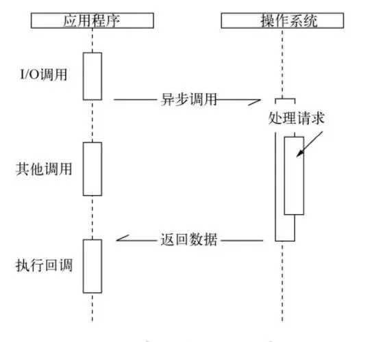

# 异步 I/O

- I/O(input/output)

- 异步 I/O 示例

```js
const fs = require("fs");

fs.readFile("/path", (err, file) => {
  console.log("读取文件完成");
});
console.log("发起读取文件");
```

- 在这里"发起读取文件"是在"读取文件完成"之前输出, 同样 "读取文件完成" 的执行也取决于文件的异步调用何时结束


