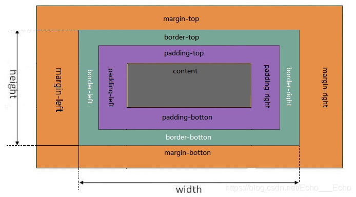

# css的盒模型(Box Modle)

> *盒子模型(Box Modle)可以用来对元素布局，包括内边距，边框，外边距，和实际内容*

#### 盒子模型分为两种:

- 第一种是 W3C 标准的盒子模型(标准盒模型)
- 第二种是 IE 标准的盒子模型(怪异盒模型)

#### 标准盒模型与怪异盒模型的表现效果的区别之处:

> ##### 1. 标准盒模型中 

   - ``width`` 和 ``height`` 指的是内容区域 ``content`` 的宽度
   - 标准盒模型下盒子的大小 = content + border + padding + margin
   

> ##### 2. 怪异盒模型中
   
   - ``width`` 和 ``height``指的是内容，边框，内边距总的宽度(content + border + padding)
   - 怪异盒模型下盒子的大小 = width (content + border + padding) + margin
     

- 还可以通过 ``box-sizing`` 设置盒子模型的解析方式
   
  - ``content-box``:默认值，``border``和``padding``不算到 ``width``范围内w3c标准模型(default)
      
      - 总宽 = width + padding + border + margin  
  - ``border-box``: ``border``和``padding``归划到``width``范围内ie怪异模型
      
      - 总宽 = width + margin 