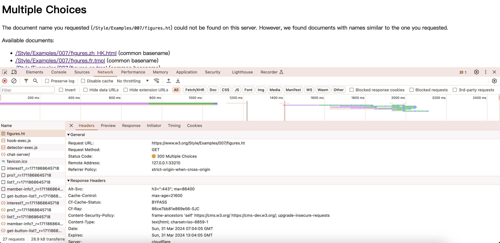
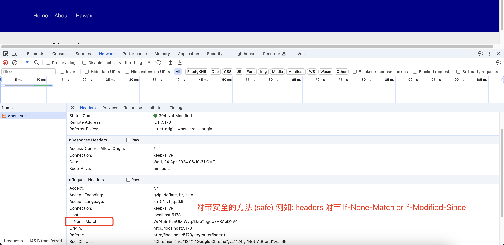
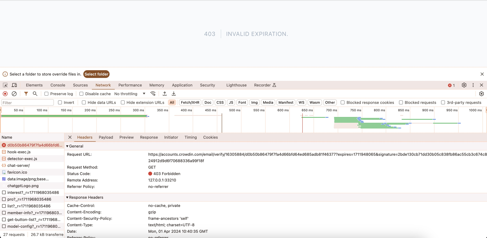
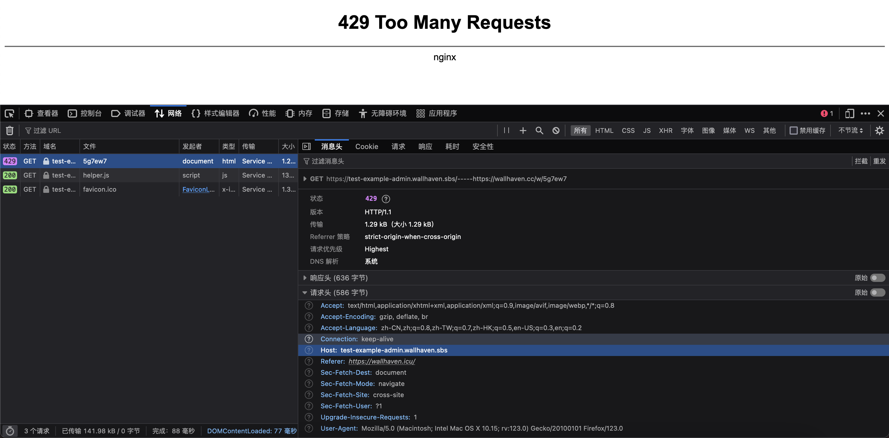

# http 状态码

> #### _状态码类别：_

- [状态码](https://developer.mozilla.org/zh-CN/docs/Web/HTTP/Status/100)

|         |           类别            |          原因短语          |
| ------- | :-----------------------: | :------------------------: |
| 100~199 | Informational(信息状态码) |     接受的请求正在处理     |
| 200~299 |     Success(请求成功)     |      请求正常处理完毕      |
| 300~399 | Redirection(重定向状态码) | 需要进行附加操作已完成请求 |
| 400~499 | Client Error(客户端错误)  |     服务器无法处理请求     |
| 500~599 | Server Error(服务器错误 ) |     服务器处理请求出错     |

> ## **100~199 临时响应**

- 100(Continue): 目前请求正常应当继续请求(如果已完成请求则忽略);

> ## **200~299 成功**

- 200(ok): 请求已成功。 表示从客户端发来的请求在服务器端被正常处理了。

- 201(Created): 请求已成功,并因此创建了一个新的资源。

- 202(Accepted): 请求已被接受,但还未处理。

> ## **300~399 重定向**

- 300(Multiple Choices)重定向响应状态码，表示该请求拥有多种可能的响应。

- 301(Moved Permanently)永久重定向。 该状态码表示请求的资源已被分配了新的 URL。

- 302(Found)临时重定向。该状态码表示请求的资源已被分配了新的 URL，希望用户（本次）能使用 新的 URL 进行访问

- 304(Not Modified)缓存的内容。无需在次传输请求内容,也就是说可以使用缓存内容
  - HTTP/1.1 304 Not Modified
  - Access-Control-Allow-Origin: \*
  - Date: Wed, 24 Apr 2024 06:10:31 GMT
  - Connection: keep-alive
  - Keep-Alive: timeout=5
    

> ## **400~499 客户端错误**

- 400(Bad Request): 该状态码表示请求出现错误，请求无法被服务器理解。

- 401(Unauthorized): 该状态码表示请求要求身份验证。对于需要登录的网页，服务器可能返回此响应。

- 403(Forbidden): 客户端错误,指服务器有能力处理该请求,但拒绝授权访问
  

- 404(Not Found): 请求资源不存在

- 413(Request Entity Too Large): 服务无法处理请求, 请求数据量过大,超出服务器端的限制。

- 429(Too Many Requests): 在一定的时间内用户发送了太多的请求, 超出了"频次限制"。
  

> ## **500~599 服务器错误**

- 500(Internal Server Error): 表示服务器端在执行请求时发生了错误。

- 501(Not Implemented): 表示服务器不支持请求的功能。

- 502(Bad Gateway): 表示作为网关或者代理工作的服务器尝试执行请求时，从上游服务器接收到无效的响应。

- 503(Service Unavailable): 表明服务器暂时处于超负载或正在停机维护，无法处理请求。

<!-- - 504(Gateway Timeout): 该状态码表示作为网关或者代理工作的服务器尝试执行请求时，未能从上游服务器接收到响应。 -->

<!-- - 505(HTTP Version Not Supported): 该状态码表示服务器不支持请求中使用的 HTTP 协议版本。 -->

<!-- - 506(Variant Also Negotiates): 该状态码表示服务器存在内部配置错误：被请求的变体有配置中 未被通知，无法处理。 -->

<!-- - 507(Insufficient Storage): 该状态码表示服务器无法存储完成请求所必须的内容。 -->

<!-- - 508(Loop Detected): 该状态码表示服务器在处理请求时陷入死循环。 -->

<!-- - 509(Bandwidth Limit Exceeded): 该状态码表示服务器达到带宽限制。 -->

<!-- - 510(Not Extended): 该状态码表示获取资源所需要的策略并没有没满足。 -->

<!-- - 511(Network Authentication Required): 该状态码表示客户端需要进行身份验证才能获得网络访问权限。 -->
