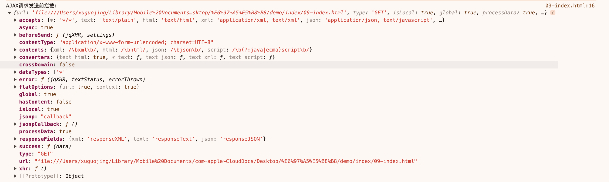
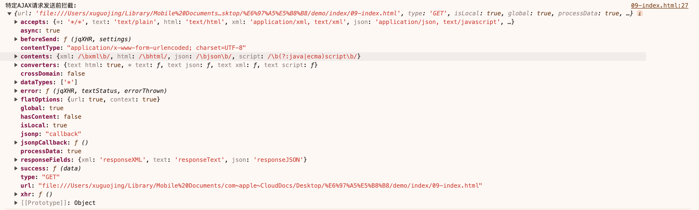

# ajax

## 请求拦截

- 全局请求拦截

```js
// 设置全局AJAX请求拦截器
$(document).ajaxSend(function (event, jqXHR, ajaxOptions) {
  // 在这里可以访问jqXHR对象和ajax选项
  console.log("AJAX请求发送前拦截:", ajaxOptions);
  // 可以在这里修改jqXHR对象或ajax选项
  // ...
});
```

- 打印
  

- 特定的请求拦截

```js
// 设置特定AJAX请求的拦截器
$.ajax({
  url: "",
  type: "GET",
  beforeSend: function (jqXHR, settings) {
    // 在这里可以访问jqXHR对象和ajax选项
    console.log("特定AJAX请求发送前拦截:", settings);
    // 可以在这里修改jqXHR对象或ajax选项
    // ...
  },
  success: function (data) {
    // 处理响应数据
  },
  error: function (jqXHR, textStatus, errorThrown) {
    // 处理错误
  },
});
```

- 打印
  

## 响应拦截

- 全局响应拦截

```js
// 设置全局AJAX响应拦截器
$(document).ajaxComplete(function (event, jqXHR, ajaxOptions) {
  // 在这里可以访问jqXHR对象和ajax选项
  console.log("AJAX请求完成拦截:", jqXHR);
  // 可以在这里修改jqXHR对象或ajax选项
  // ...
});
```
